# 🚛 Mission_ImCodeable_Fleet_Flow

**Fleet Flow** — A modular fleet and logistics management system that replaces manual logbooks with a centralized, rule-based digital hub for optimizing delivery fleet operations, driver safety, and financial performance.

Built for the **Odoo x Gujarat Vidyapith Hackathon '26**.

---

## 📋 Table of Contents

- [Overview](#overview)
- [Database Schema](#database-schema)
- [Screenshots](#screenshots)
- [Features](#features)
- [Tech Stack](#tech-stack)
- [Project Structure](#project-structure)
- [Prerequisites](#prerequisites)
- [Setup & Configuration](#setup--configuration)
- [Running the Application](#running-the-application)
- [Mock Data](#mock-data)
- [API Documentation](#api-documentation)
- [Roles & Permissions](#roles--permissions)
- [Application Gallery](#-application-gallery)

---

## Overview

Fleet Flow provides end-to-end fleet lifecycle management across four distinct user roles:

- **Fleet Manager** — Vehicle registry, maintenance logs, asset oversight
- **Dispatcher** — Trip creation, driver assignment, cargo validation
- **Safety Officer** — Driver compliance, license tracking, safety scores
- **Financial Analyst** — Expense auditing, fuel logging, operational analytics

Every action is enforced with strict **Role-Based Access Control (RBAC)** at both the backend (URL-level + method-level security) and frontend (route guards + UI permission checks).

---

## Database Schema

Fleet Flow uses a normalized relational schema with **10 tables**, UUID primary keys, and enforced foreign-key relationships across all modules.

<p align="center">
  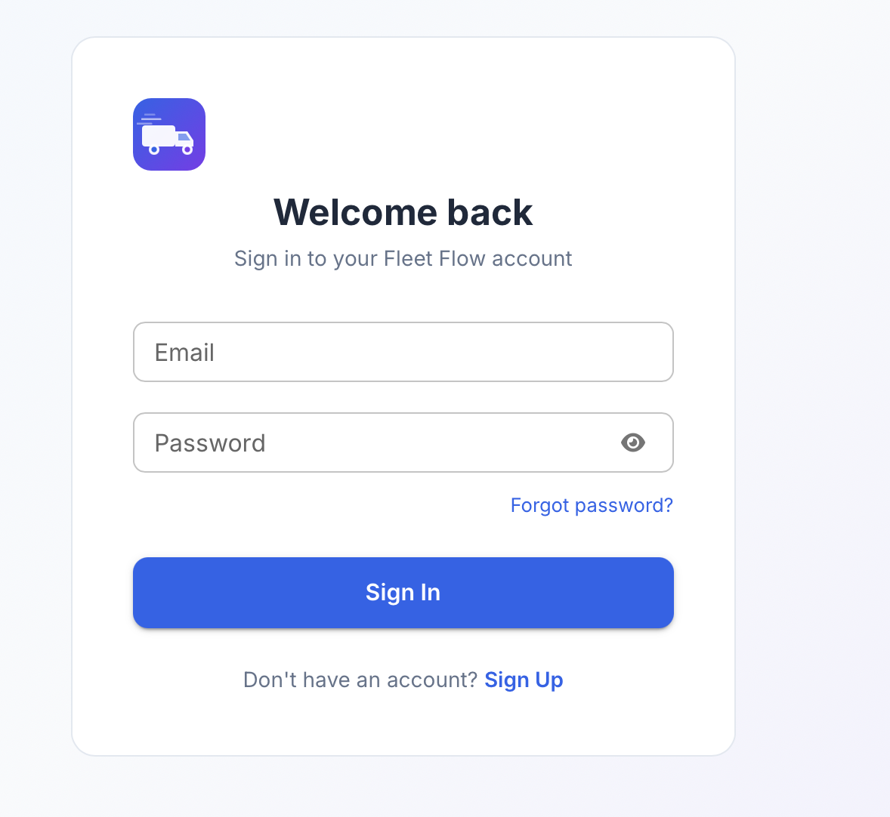
</p>
<p align="center"><em>Entity-Relationship diagram — MySQL Workbench</em></p>

### Tables & Relationships

```
users
 ├──< drivers.created_by              (1 : N)
 ├──< vehicles.created_by             (1 : N)
 ├──< trips.dispatched_by             (1 : N)
 ├──< expenses.created_by             (1 : N)
 ├──< fuel_logs.recorded_by           (1 : N)
 ├──< maintenance_logs.created_by     (1 : N)
 ├──< password_reset_tokens.user_id   (1 : N)
 └──— verification_tokens.user_id     (1 : 1)

vehicles
 ├──< trips.vehicle_id                (1 : N)
 ├──< expenses.vehicle_id             (1 : N)
 ├──< fuel_logs.vehicle_id            (1 : N)
 └──< maintenance_logs.vehicle_id     (1 : N)

drivers
 ├──< trips.driver_id                 (1 : N)
 └──< expenses.driver_id              (1 : N)

trips
 ├──< expenses.trip_id                (1 : N)
 └──< fuel_logs.trip_id               (1 : N, optional)

monthly_financial_summaries           (standalone aggregate)
```

### Key Schema Highlights

| Table | Key Columns | Business Rules |
|-------|-------------|----------------|
| **users** | `email` (unique), `employee_id` (unique), `role` (enum) | JWT auth, email verification, 4 roles |
| **vehicles** | `license_plate` (unique), `type` (enum), `max_load_capacity` | Status: Available → On Trip → In Shop → Retired |
| **drivers** | `license_number` (unique), `safety_score`, `completion_rate` | License expiry blocking, status management |
| **trips** | `trip_number` (unique), `cargo_weight`, `revenue` | Cargo validation against vehicle capacity |
| **expenses** | `fuel_cost`, `misc_expense`, `total_cost` (auto-computed) | `total_cost = fuel_cost + misc_expense` via `@PrePersist` |
| **fuel_logs** | `liters`, `cost`, `odometer_at_fill` | Per-vehicle fuel tracking, optional trip link |
| **maintenance_logs** | `service_name`, `cost`, `status` | Auto sets vehicle → "In Shop" on creation |
| **monthly_financial_summaries** | `revenue`, `fuel_cost`, `maintenance_cost`, `net_profit` | `net_profit` auto-computed, unique `(year, month)` |

> All IDs are `UUID`. All timestamps use Hibernate's `@CreationTimestamp` / `@UpdateTimestamp`. All enums stored as `STRING`.

---

## Screenshots

### Authentication

| Login | Register |
|:---:|:---:|
|  |  |

| Email Verification | Welcome Email |
|:---:|:---:|
| 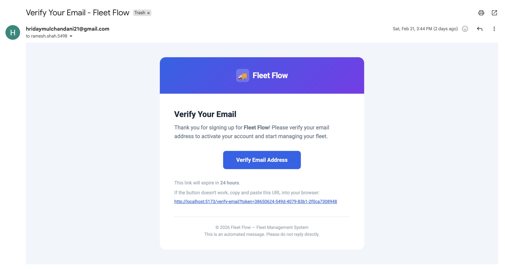 | 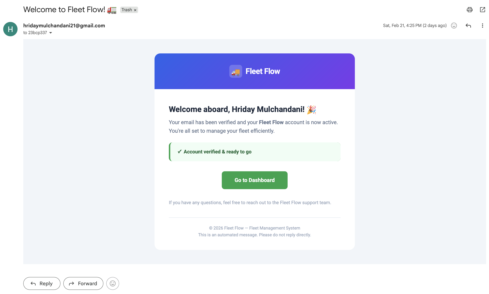 |

### Command Center (Dashboard)

> Role-aware KPIs — active fleet count, vehicles in shop, utilization rate, pending cargo, and recent trips.

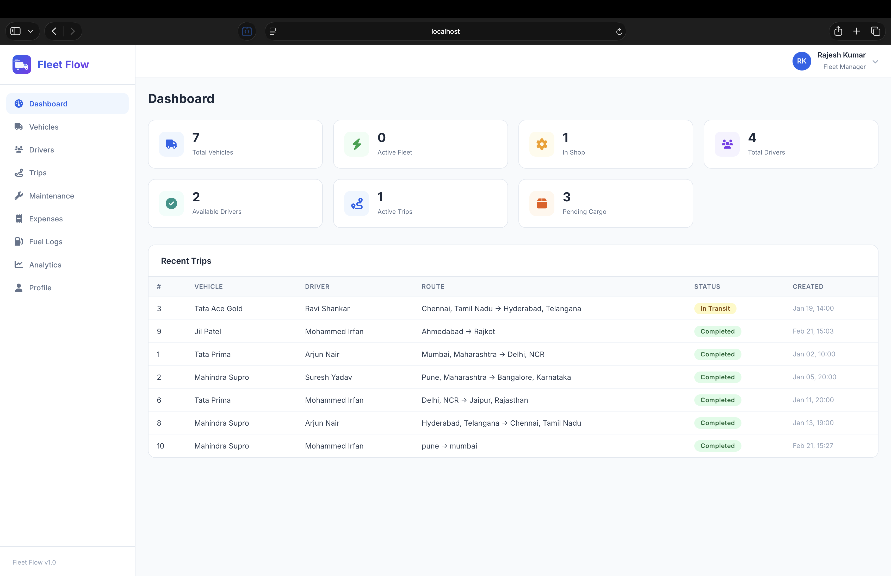

### Vehicle Management — Full CRUD

> **Fleet Manager** role — create, read, update, and delete vehicles with license plate enforcement, load capacity, and status management.

| Vehicle Registry | Edit Vehicle | Add Vehicle |
|:---:|:---:|:---:|
| 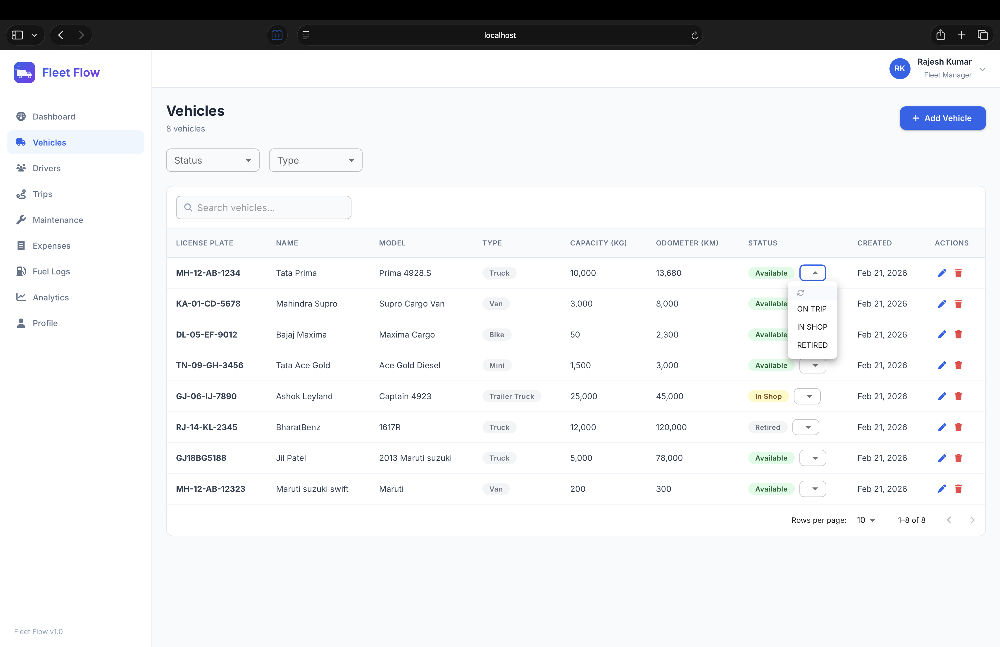 | 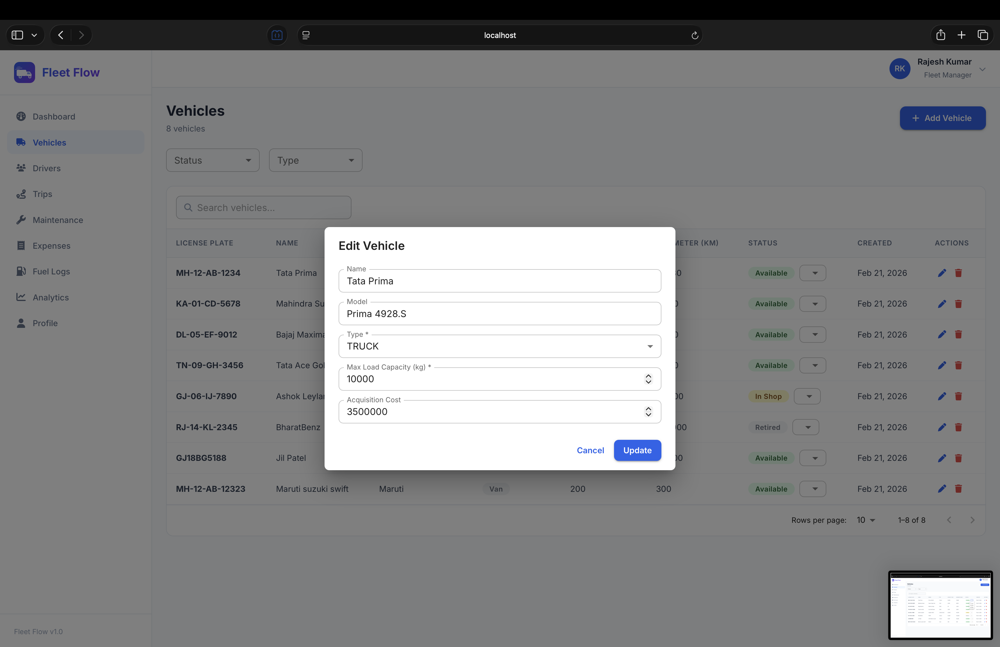 | 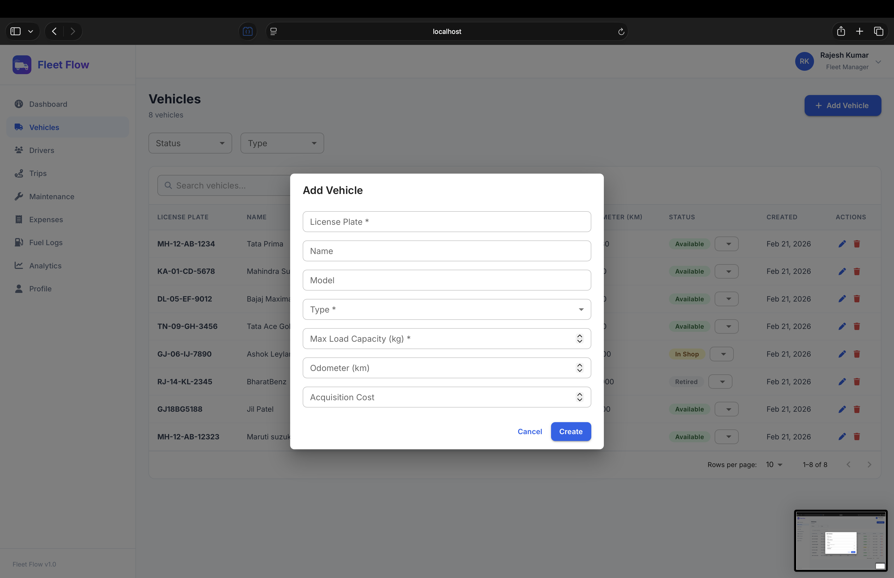 |

### Trip Dispatcher — Full CRUD

> **Dispatcher** role — create trips with automatic cargo weight validation, sorting, filtering, and status lifecycle management.

| Trip List with Filters | Trip Sorting & Search | Create Trip (Cargo Validation) |
|:---:|:---:|:---:|
| 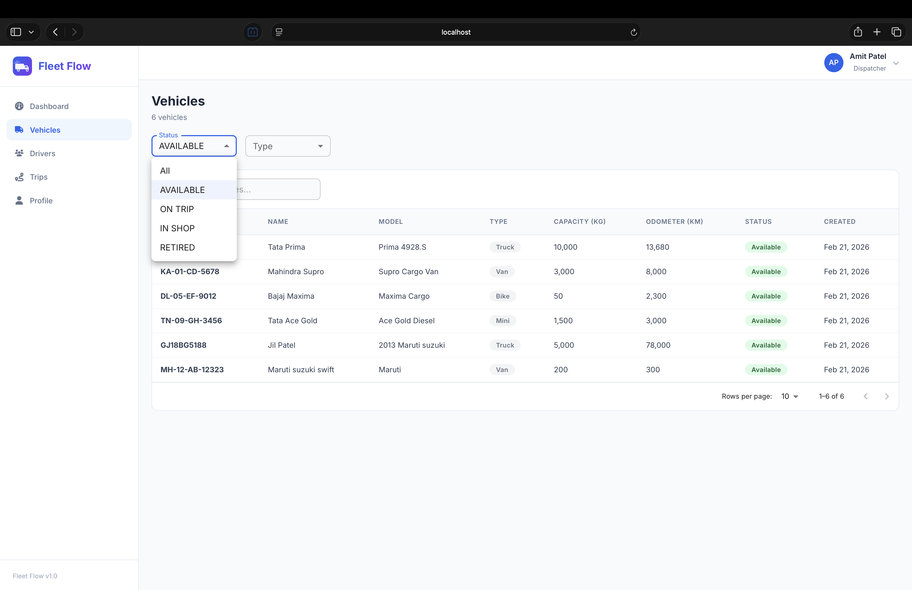 |  | 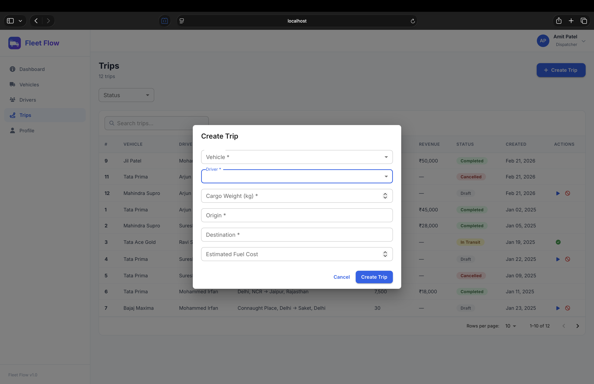 |

### Driver Management — Full CRUD

> **Safety Officer** role — add drivers, manage statuses, track license expiry, safety scores, and complaints.

| Driver List & Status | Add Driver | Driver Overview |
|:---:|:---:|:---:|
| 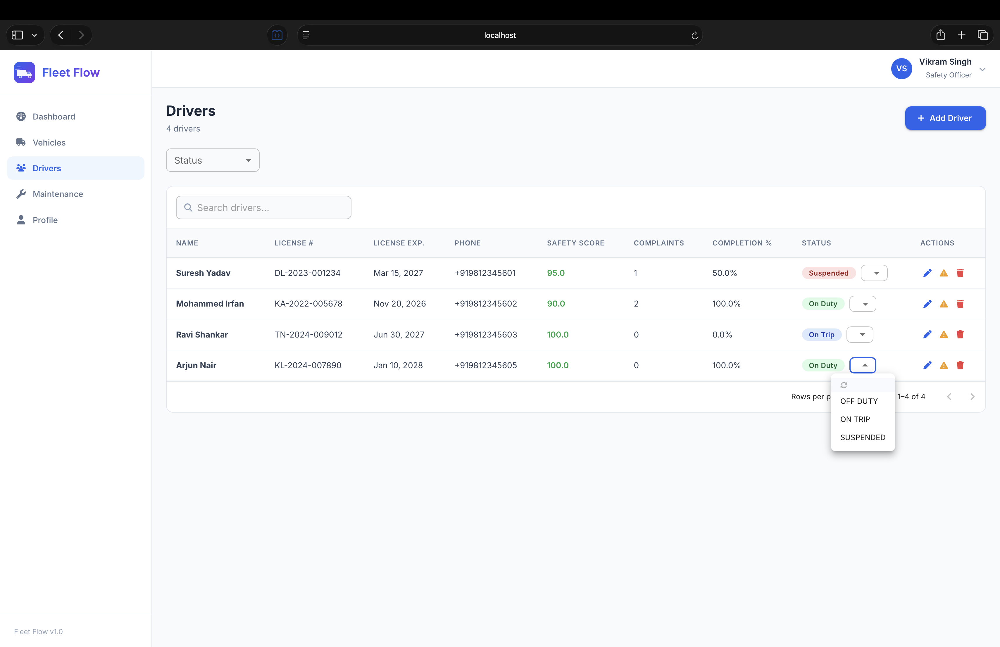 | 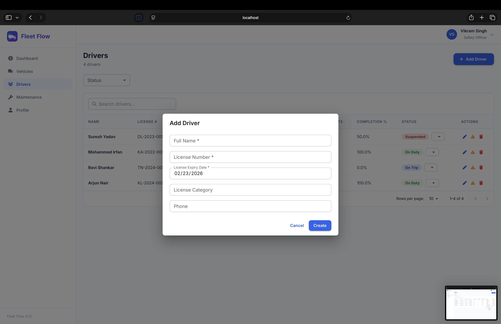 | 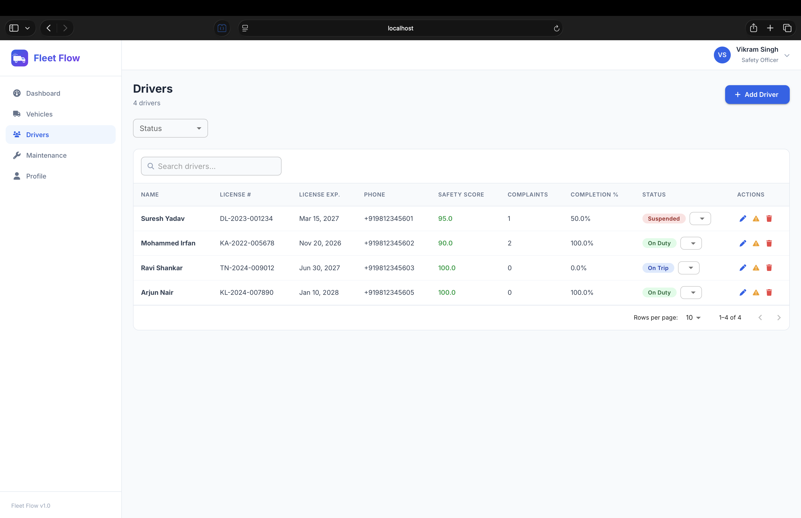 |

### Financial Analyst Views

> **Financial Analyst** role — expense auditing, fuel logging, analytics dashboards, and operational insights.

| Analytics & Reports | Cost Breakdown |
|:---:|:---:|
| 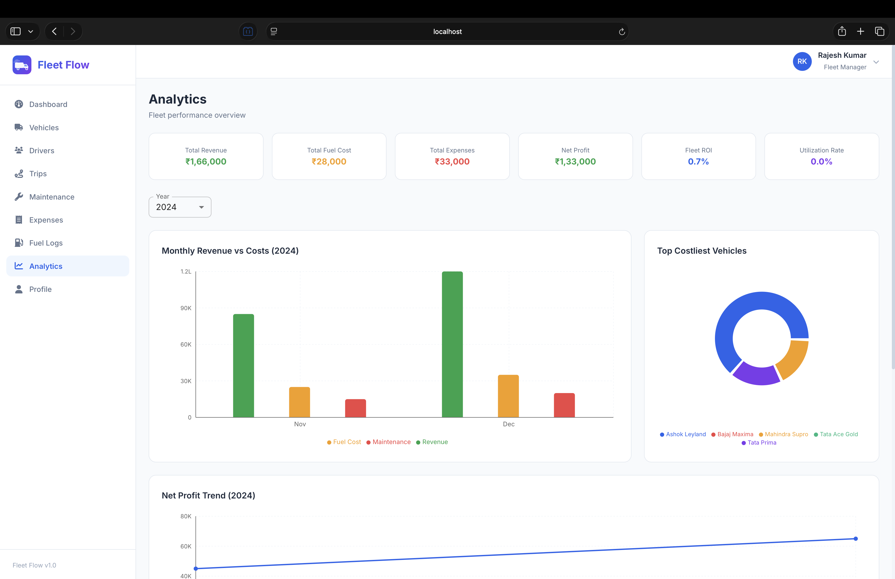 | 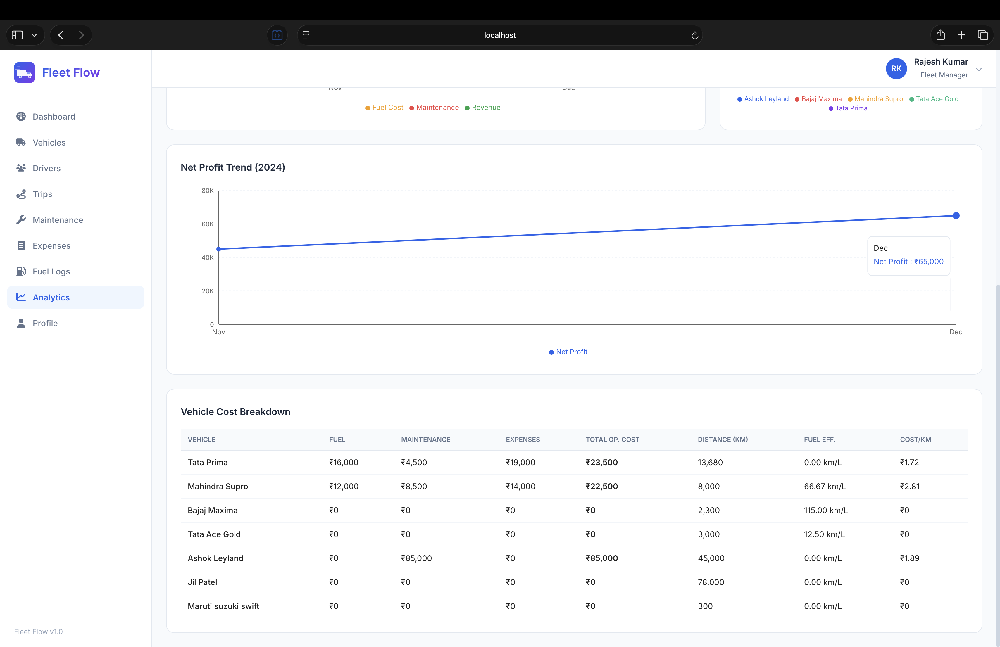 |

---

## Features

### Authentication & Security
- JWT-based stateless authentication
- BCrypt password hashing
- Email verification with branded HTML emails
- Forgot/reset password flow with secure tokens
- Role-based route protection

### Command Center (Dashboard)
- Active fleet count, vehicles in shop, utilization rate, pending cargo
- Recent trips table with status indicators
- Role-aware KPI cards

### Vehicle Registry
- Full CRUD for vehicles (name, model, license plate, max load capacity, odometer)
- Status management: Available → On Trip → In Shop → Retired
- Unique license plate enforcement

### Trip Dispatcher
- Trip lifecycle: Draft → Dispatched → In Transit → Completed / Cancelled
- **Cargo weight validation** — rejects trips where cargo exceeds vehicle max capacity
- **Automated state transitions** — vehicle & driver status auto-flip to "On Trip" on dispatch, back to "Available" on completion

### Maintenance & Service Logs
- **Auto In-Shop logic** — creating a maintenance log automatically switches the vehicle status to "In Shop", removing it from the dispatcher's available pool
- Track service name, issue description, cost, and resolution status

### Driver Performance & Safety
- **License expiry blocking** — expired licenses prevent driver assignment to trips
- Safety scores, trip completion rates, complaint tracking
- Status toggles: On Duty / Off Duty / Suspended

### Expense & Fuel Logging
- Per-trip expense tracking (fuel cost + miscellaneous)
- **Auto-calculated total operational cost** per vehicle
- Fuel logs with liters, cost, odometer at fill, and date

### Operational Analytics
- Revenue vs. costs bar charts (monthly)
- Net profit trend line charts
- Top costliest vehicles (donut chart)
- Vehicle cost breakdown table: **fuel efficiency (km/L)**, **cost per km**, **Vehicle ROI**
- One-click monthly financial summary generation

---

## Tech Stack

| Layer | Technology |
|-------|-----------|
| **Backend** | Java, Spring Boot, Spring Security, JPA/Hibernate, Maven |
| **Frontend** | React, Vite, Material UI (MUI), Recharts, React Router, Axios |
| **Database** | MySQL |
| **Auth** | JWT, BCrypt, SMTP Email (Gmail) |
| **API Docs** | Swagger / OpenAPI |

---

## Project Structure

```
Mission_ImCodeable_Fleet_Flow/
├── Backend/
│   ├── src/main/java/com/hackathon/securestarter/
│   │   ├── config/          # Security, CORS, app configuration
│   │   ├── controller/      # REST API controllers (10 controllers)
│   │   ├── dto/             # Request/Response DTOs
│   │   ├── entity/          # JPA entities (10 entities)
│   │   ├── enums/           # Status enums (VehicleStatus, TripStatus, etc.)
│   │   ├── exception/       # Global exception handling
│   │   ├── repository/      # Spring Data JPA repositories
│   │   ├── security/        # JWT filter, OAuth2 handlers
│   │   ├── service/         # Business logic layer
│   │   └── util/            # Constants, token generators
│   ├── src/main/resources/
│   │   ├── application.properties   # ⚠️ You must create this (see below)
│   │   ├── mock_data.sql            # Sample data for testing
│   │   └── Fleet_Flow_API.postman_collection.json
│   └── pom.xml
├── Frontend/
│   ├── src/
│   │   ├── api/             # Axios API modules (11 modules)
│   │   ├── components/      # Reusable UI components
│   │   ├── context/         # Auth context provider
│   │   ├── hooks/           # Custom React hooks
│   │   ├── layouts/         # App layout with sidebar
│   │   ├── pages/           # All feature pages (14 pages)
│   │   ├── utils/           # Constants, validators, helpers
│   │   ├── App.jsx          # Router configuration
│   │   └── main.jsx         # App entry point
│   ├── vite.config.js
│   └── package.json
└── .gitignore
```

---

## Prerequisites

- **Java** 21+
- **Maven** (or use the included `mvnw` wrapper)
- **MySQL** 8+
- **Node.js** 18+
- **npm** 9+
- A **Gmail account** with an [App Password](https://support.google.com/accounts/answer/185833) for sending emails

---

## Setup & Configuration

### 1. Clone the Repository

```bash
git clone git@github.com:HridayBuilds/Mission_ImCodeable_Fleet_Flow.git
cd Mission_ImCodeable_Fleet_Flow
```

### 2. Create the MySQL Database

```sql
CREATE DATABASE Fleet_Flow_DB;
```

### 3. Configure Backend — `application.properties`

Create the file at `Backend/src/main/resources/application.properties`:

```properties
# Application
spring.application.name=fleet-flow
server.port=8080

# Database — update with your MySQL credentials
spring.datasource.url=jdbc:mysql://localhost:3306/Fleet_Flow_DB
spring.datasource.username=YOUR_MYSQL_USERNAME
spring.datasource.password=YOUR_MYSQL_PASSWORD
spring.datasource.driver-class-name=com.mysql.cj.jdbc.Driver

# JPA/Hibernate
spring.jpa.hibernate.ddl-auto=update
spring.jpa.show-sql=true
spring.jpa.properties.hibernate.format_sql=true
spring.jpa.properties.hibernate.dialect=org.hibernate.dialect.MySQLDialect

# JWT — generate your own secret (base64-encoded, 512-bit minimum)
jwt.secret=YOUR_JWT_SECRET_BASE64
jwt.expiration-ms=2592000000

# CORS
cors.allowed-origins=http://localhost:3000,http://localhost:5173
cors.allowed-methods=GET,POST,PUT,DELETE,PATCH,OPTIONS
cors.allowed-headers=*
cors.exposed-headers=Authorization
cors.allow-credentials=true
cors.max-age=86400

# Email — use a Gmail App Password (not your regular password)
spring.mail.host=smtp.gmail.com
spring.mail.port=587
spring.mail.username=YOUR_EMAIL@gmail.com
spring.mail.password=YOUR_GMAIL_APP_PASSWORD
spring.mail.properties.mail.smtp.auth=true
spring.mail.properties.mail.smtp.starttls.enable=true
spring.mail.properties.mail.smtp.starttls.required=true

# Email sender
app.email.from=noreply@fleetflow.com
app.frontend.url=http://localhost:5173

# Logging
logging.level.root=INFO
logging.level.com.hackathon.securestarter=DEBUG
```

> **Generate a JWT secret:**
> ```bash
> openssl rand -base64 64
> ```

> **Get a Gmail App Password:**
> Go to [Google Account → Security → App Passwords](https://myaccount.google.com/apppasswords), generate one for "Mail", and use it as `spring.mail.password`.

### 4. Install Frontend Dependencies

```bash
cd Frontend
npm install
```

---

## Running the Application

### Start the Backend

```bash
cd Backend
./mvnw spring-boot:run
```

The backend starts at `http://localhost:8080`.

### Start the Frontend

```bash
cd Frontend
npm run dev
```

The frontend starts at `http://localhost:5173`. The Vite dev server proxies all `/api` requests to the backend automatically.

---

## Mock Data

To populate the database with sample data for testing, run the provided SQL file against your MySQL database:

```bash
mysql -u YOUR_USERNAME -p Fleet_Flow_DB < Backend/src/main/resources/mock_data.sql
```

> **Note:** Make sure the backend has run at least once so Hibernate creates the tables before importing mock data.

---

## API Documentation

- **Swagger UI:** `http://localhost:8080/swagger-ui/index.html` (available when backend is running)
- **Postman Collection:** Import `Backend/src/main/resources/Fleet_Flow_API.postman_collection.json` into Postman for all 81 pre-configured API requests

---

## Roles & Permissions

| Feature | Fleet Manager | Dispatcher | Safety Officer | Financial Analyst |
|---------|:---:|:---:|:---:|:---:|
| **Vehicles** | Read + Write | Read | Read | — |
| **Drivers** | Read | Read | Read + Write | — |
| **Trips** | Read | Read + Write | — | — |
| **Maintenance** | Read + Write | — | Read | Read |
| **Expenses** | Read | — | — | Read + Write |
| **Fuel Logs** | Read | — | — | Read + Write |
| **Analytics** | Read | — | — | Read + Write |
| **Dashboard** | ✅ | ✅ | ✅ | ✅ |
| **Profile** | ✅ | ✅ | ✅ | ✅ |

---

## 🖼 Application Gallery

A closer look at the remaining screens in Fleet Flow.

<details>
<summary><strong>User Profile</strong></summary>
<br>

> View and manage personal details, role information, and account settings.

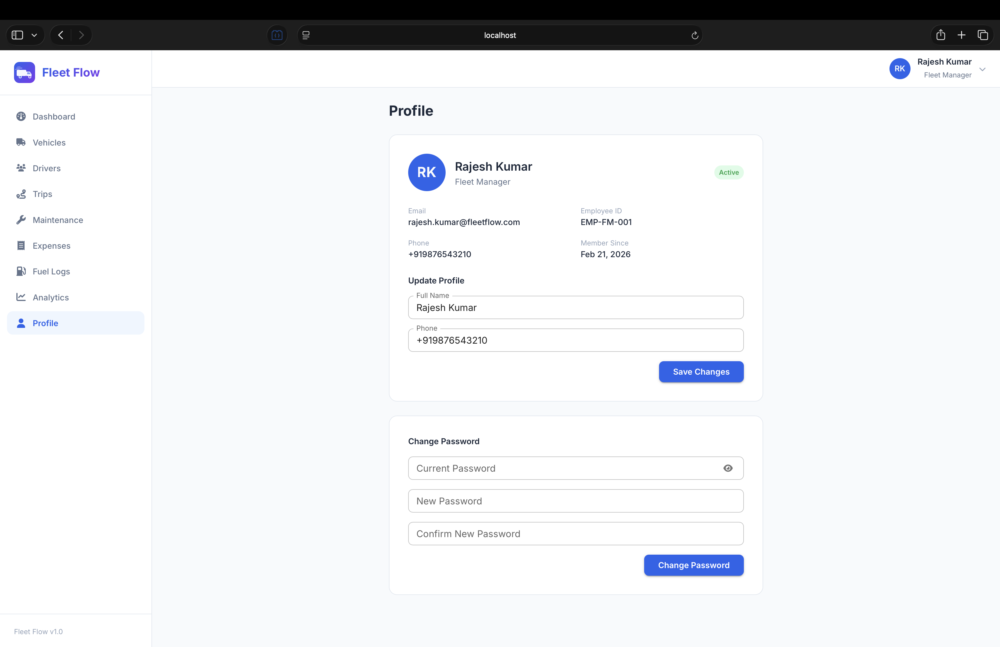

</details>

<details>
<summary><strong>Email Verification Flow</strong></summary>
<br>

> Branded HTML emails are sent on signup. Users must verify their email before accessing the platform.

| Verification Link | Welcome Confirmation |
|:---:|:---:|
|  |  |

</details>

<details>
<summary><strong>Database Schema (MySQL Workbench)</strong></summary>
<br>

> Full ER diagram showing all 10 tables, relationships, and constraints.


</details>

---

## Team

**Mission ImCodeable**

Built for the Odoo x Gujarat Vidyapith Hackathon '26.
